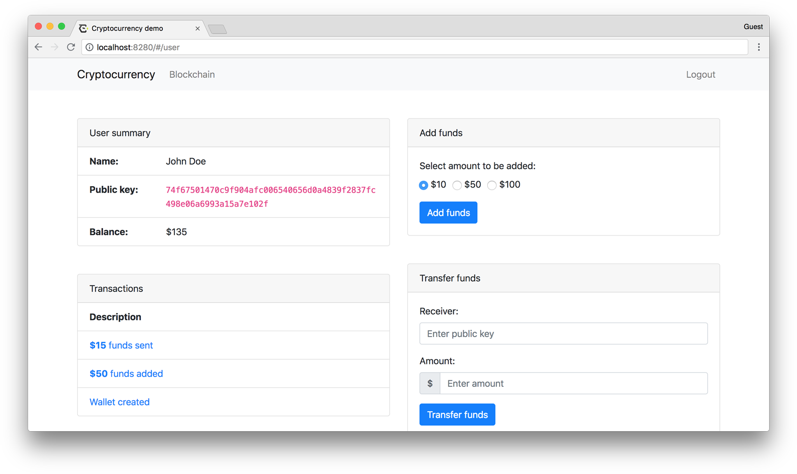

# Cryptocurrency Advanced: Service with Data Proofs

The extended version of the
[Cryptocurrency Service](https://github.com/vega/vega/tree/master/examples/cryptocurrency)
implementing data proofs. This project demonstrates how to bootstrap your own
cryptocurrency with [Vega blockchain](https://github.com/vega/vega).

See [the documentation](https://vega.com/doc/version/latest/get-started/data-proofs/)
for a detailed step-by-step guide how to approach this example.



Vega blockchain keeps balances of users and handles secure
transactions between them.

It implements most basic operations:

- Create a new user
- Add funds to the user's balance
- Transfer funds between users

## Install and run

### Using docker

Simply run the following command to start the cryptocurrency service on 4 nodes
on the local machine:

```bash
docker run -p 8000-8008:8000-8008 vegahub/vega-cryptocurrency-advanced:v0.1.0
```

Ready! Find demo at [http://127.0.0.1:8008](http://127.0.0.1:8008).

Docker will automatically pull image from the repository and
run 4 nodes with public endpoints at `127.0.0.1:8000`, ..., `127.0.0.1:8003`
and private ones at `127.0.0.1:8004`, ..., `127.0.0.1:8007`.

To stop docker container, use `docker stop <container id>` command.

### Manually

#### Getting started

Be sure you installed necessary packages:

- [git](https://git-scm.com/downloads)
- [Node.js with npm](https://nodejs.org/en/download/)
- [Rust compiler](https://rustup.rs/)
- [Vega launcher](https://github.com/vega/vega-launcher)

#### Install and run

Below you will find a step-by-step guide to starting the cryptocurrency
service on 4 nodes on the local machine.

Build the project:

```sh
git clone https://github.com/vega/vega

cd vega/examples/cryptocurrency-advanced/backend

cargo install --path .
```

Generate template:

<!-- markdownlint-disable MD013 -->

```sh
mkdir example

vega-cryptocurrency-advanced generate-template example/common.toml --validators-count 4
```

Generate public and secrets keys for each node:

```sh
vega-cryptocurrency-advanced generate-config example/common.toml  example/1 --peer-address 127.0.0.1:6331 -n

vega-cryptocurrency-advanced generate-config example/common.toml  example/2 --peer-address 127.0.0.1:6332 -n

vega-cryptocurrency-advanced generate-config example/common.toml  example/3 --peer-address 127.0.0.1:6333 -n

vega-cryptocurrency-advanced generate-config example/common.toml  example/4 --peer-address 127.0.0.1:6334 -n
```

Note that in case of copying file with master key to the other machines, you must change the access permissions of this file for every machine.
For example:

```sh
sudo chmod 600 master.key.toml
```

Finalize configs:

```sh
vega-cryptocurrency-advanced finalize --public-api-address 0.0.0.0:8200 --private-api-address 0.0.0.0:8091 example/1/sec.toml example/1/node.toml --public-configs example/{1,2,3,4}/pub.toml

vega-cryptocurrency-advanced finalize --public-api-address 0.0.0.0:8201 --private-api-address 0.0.0.0:8092 example/2/sec.toml example/2/node.toml --public-configs example/{1,2,3,4}/pub.toml

vega-cryptocurrency-advanced finalize --public-api-address 0.0.0.0:8202 --private-api-address 0.0.0.0:8093 example/3/sec.toml example/3/node.toml --public-configs example/{1,2,3,4}/pub.toml

vega-cryptocurrency-advanced finalize --public-api-address 0.0.0.0:8203 --private-api-address 0.0.0.0:8094 example/4/sec.toml example/4/node.toml --public-configs example/{1,2,3,4}/pub.toml
```

Run nodes:

```sh
vega-cryptocurrency-advanced run --node-config example/1/node.toml --db-path example/1/db --public-api-address 0.0.0.0:8200 --master-key-pass pass

vega-cryptocurrency-advanced run --node-config example/2/node.toml --db-path example/2/db --public-api-address 0.0.0.0:8201 --master-key-pass pass

vega-cryptocurrency-advanced run --node-config example/3/node.toml --db-path example/3/db --public-api-address 0.0.0.0:8202 --master-key-pass pass

vega-cryptocurrency-advanced run --node-config example/4/node.toml --db-path example/4/db --public-api-address 0.0.0.0:8203 --master-key-pass pass
```

Before service deploy make sure that you have pure python implementation of protobuf:

```sh
pip uninstall protobuf
pip install --no-binary=protobuf protobuf
```

Deploy cryptocurrency-advanced service:

```sh
python3 -m vega_launcher -i ../cryptocurrency_advanced.yaml
```

<!-- markdownlint-enable MD013 -->

Install frontend dependencies:

```sh
cd ../frontend

npm install
```

Build sources:

```sh
npm run build
```

Run the application:

```sh
npm start -- --port=8280 --api-root=http://127.0.0.1:8200
```

`--port` is a port for Node.JS app.

`--api-root` is a root URL of public API address of one of nodes.

Ready! Find demo at [http://127.0.0.1:8280](http://127.0.0.1:8280).

## Tutorials

- Read the
  [frontend tutorial](https://github.com/vega/vega/blob/master/examples/cryptocurrency-advanced/tutorial/frontend.md)
  to get detailed information about the interaction of the client with Vega blockchain.

## License

Cryptocurrency demo is licensed under the Apache License (Version 2.0).
See [LICENSE](LICENSE) for details.
